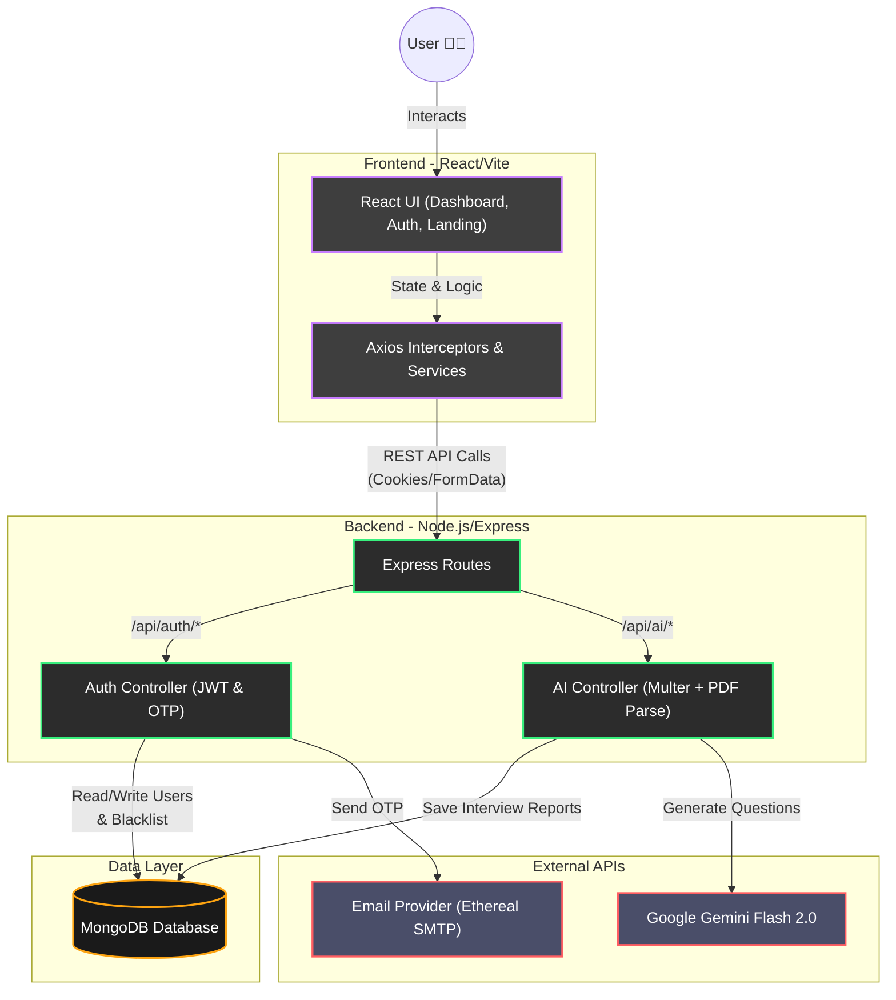

# PrepMind

PrepMind is a full-stack AI-powered interview preparation application. It uses the Gemini API to generate personalized interview questions and a preparation plan based on a user's resume and target job description.

## Tech Stack

- **Frontend**: React 19, Vite, React Router, SCSS, Axios
- **Backend**: Node.js, Express, MongoDB, Mongoose, JSON Web Tokens (JWT) for authentication
- **AI Integration**: `@google/genai` (Gemini Flash 2.0)

---

## System Architecture

---

## Getting Started

Follow these instructions to run the project locally.

### Prerequisites
- [Node.js](https://nodejs.org/) (v18+)
- [MongoDB](https://www.mongodb.com/) (Local or Atlas Cluster)
- A Google Gemini API Key

### 1. Clone the repository
\`\`\`bash
git clone <your-repo-url>
cd prepmind
\`\`\`

### 2. Backend Setup
\`\`\`bash
cd backend
npm install
\`\`\`

Create a `.env` file in the `backend` folder based on the `.env.example`:
\`\`\`env
PORT=3000
MONGO_URI=your_mongodb_connection_string
JWT_SECRET=your_super_secret_jwt_key
GOOGLE_GENAI_API_KEY=your_gemini_api_key
\`\`\`

Start the backend development server:
\`\`\`bash
npm run dev
\`\`\`
The backend will run on `http://localhost:3000`.

### 3. Frontend Setup
Open a **new terminal** and run:
\`\`\`bash
cd frontend
npm install
\`\`\`

Create a `.env` file in the `frontend` folder:
\`\`\`env
VITE_API_URL=http://localhost:3000/api
\`\`\`

Start the frontend development server:
\`\`\`bash
npm run dev
\`\`\`
The frontend will run on `http://localhost:5173`.

---

## Features

- **Landing Page**: A clean, aesthetic, and modern landing page introducing the PrepMind experience.
- **User Authentication**: Secure registration and login using HTTP-only cookies and JWTs.
- **Profile Management**: An integrated Edit Profile section allowing users to securely update their display name and password.
- **OTP Password Reset**: An advanced security flow that uses email-based One-Time Passwords (OTP) for verifying identity before resetting a password.
- **AI Report Generation**: Submit your target job description and directly upload your resume (PDF/Word files supported) to receive a tailored Match Score, Technical Questions, Behavioral Questions, Skill Gaps, and a multi-day Preparation Plan.
- **Responsive Dashboard**: A sleek, rich dark-themed UI featuring glassmorphism, dynamic gradients, sticky navigation, and a user profile dropdown menu.

## Deployment

- **Frontend**: Can be easily deployed to [Vercel](https://vercel.com/) or [Netlify](https://www.netlify.com/). Don't forget to set the `VITE_API_URL` environment variable.
- **Backend**: Can be deployed to [Render](https://render.com/), [Railway](https://railway.app/), or [Heroku](https://www.heroku.com/). Ensure you configure the environment variables correctly.
- **Database**: MongoDB Atlas is recommended for a free, hosted database solution.
